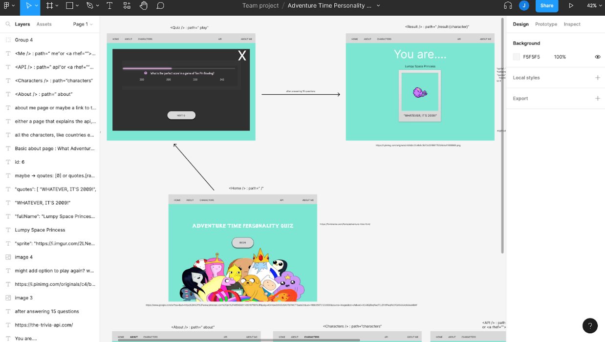
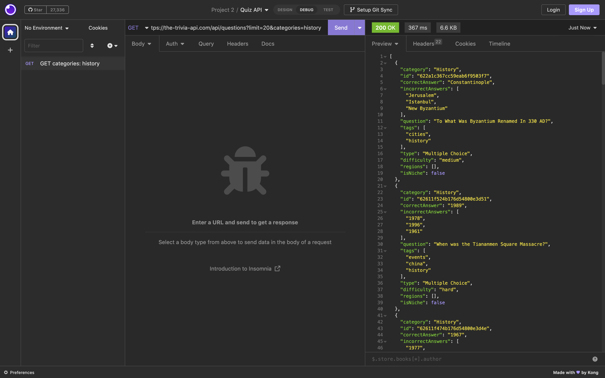
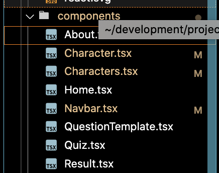
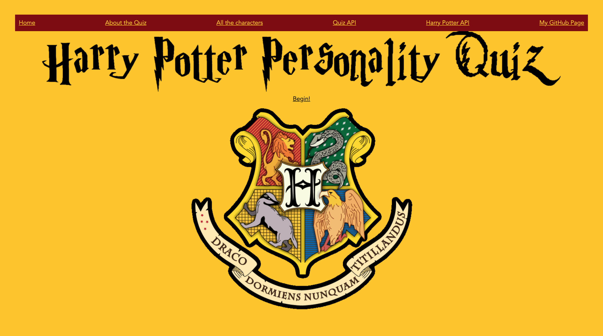

# Project 2: "Harry Potter Quiz"

## Description

During our second module, we learned how to use TypeScript and React to create the frontend components to websites, while using APIs created by other engineers to manage our backend.

I was given 10 days to create a hackathon-styled project, where we needed to use React and at least one public API to create a website.

I decided to create a quiz which used two public APIs, the Harry Potter API hosted on Heroku, and the Trivia API. I initially chose the Adventure Time API which was also hosted on Heroku, as Adventure Time is one of my favourite shows, along with the Trivia API, since I love quizzes, and wanted to create something that I would enjoy. The Adventure Time API, however, had a few parts of the API which were inaccessible so I quickly changed to the Harry Potter API.


### Link to the gane

[HERE](https://637d22ece39e7221da53729a--roaring-faloodeh-5cec60.netlify.app/)

## Getting Started/Code Installation

### React

I used starter code that was provided to me to create the directory for the project. This included:
the root folder, which has:

- a .gitignore file that tells us which files should be ignored when I’m committing and pushing code 
- an index.html which contains an element with an id of ‘root’, which is where the react code is rendered
- package.json and package-lock.json files which show which packages (frameworks and libraries) which have been installed, what their versions are and other information related to the packages
- tsconfig.json and tsconfig.node.json files which are related to how Typescript is set up in the project
- and the src folder, that lives within the root, which is where the code that I would write existed

To work on JS locally, I had to install Node.js, referencing this documentation (https://nodejs.org/en/docs/).

I then went to the package.json file and made sure that the following scripts are included:

`
  "scripts": {
      "dev": "vite",
      "build": "tsc && vite build",
      "preview": "vite preview"
`

Once node was installed, I was then able to use the terminal in VSCode with the keyword ‘npm’ (node package manager) to make changes to run the code. Running `npm run dev` would start the website in my browser, and would hot reload when any changes were made.

### API

- Harry Potter API (formerly https://hp-api.herokuapp.com/)
- Trivia API (https://the-trivia-api.com/)

I looked at the API and saw which keys and values were useful to me in the API.


## Timeframe & Working Team

- I worked independently on this
- Timeframe: 10 days


## Technologies Used

### Backend:
- Trivia API: https://the-trivia-api.com/docs/
- Harry Potter API: https://hp-api.herokuapp.com/

### Frontend:
- React
- TypeScript

### Technology Tools:
- GitHub
- Netlify
- Insomnia (Client for reaching APIs)


## Brief

### Technical Requirements:
- Consume a public API – this could be anything but it must make sense for your project.
- The app should include a router - with several "pages".
- Include wireframes - that you designed before building the app.
- Have semantically clean HTML - you make sure you write HTML that makes structural sense rather than thinking about how it might look, which is the job of CSS.
- Be deployed online and accessible to the public
- A working application, hosted somewhere on the internet
- A link to your hosted working app in the URL section of your Github repo
- A git repository hosted on Github, with a link to your hosted project, and frequent commits dating back to the very beginning of the project
- A readme.md file with:
  - Explanations of the technologies used
  - A couple of paragraphs about the general approach you took
  - Installation instructions for any dependencies
  - Link to your wireframes – sketches of major views / interfaces in your application
  - Descriptions of any unsolved problems or major hurdles your team had to overcome


## Planning


### [Wireframe](https://www.figma.com/file/dgeh6t50CvdtWwhT6hhfkh/Adventure-Time-Personality-Test?t=LhPKGwgIH4oWyza4-1)

I then used Figma to make more of an elaborate prototype for the look and behaviour of the game 
This was a single-person project, so I was responsible for the design, engineering and deployment of the project


## Build/Code Process

In previous projects, I noticed that I found the learning process easier when I could build a project that was related to what I enjoy.

I’m a massive fan of a show called Adventure Time, and love going to pub quizzes with friends.

This was the inspiration for creating the personality quiz.

During the design and prototyping process of the project, I thought about how the app was supposed to look, how it would behave and how ‘state’ would be stored and modified by my players’ actions.
multiple arrays of answers, with numbers between 1-9, that were predefined to ensure that the logic in the game was correct.



Then, I found my APIs and tested them with Insomnia, and saw that I was able to use the Trivia API for my needs, but noticed that the Adventure Time API stored images with Flickr, and as I tried to retrieve some of the images through my client, I was blocked from viewing them due to CORS restrictions.

As a result, I decided to replace the Adventure Time API with the Harry Potter API.

Once the planning in Figma was completed, and the APIs were chosen, I then began the coding of the project.

To begin working on the code, I downloaded starter code that was provided to me by my instructor, Nick, which contained an index.html file, which had an element with an id of ‘root’, which is where the React code would be rendered.

I enjoyed using React as I can see how the tools available can be used for scaling up a website with components and props.

My components for the website were kept in a Components folder within the src folder in the root of my project.



The Character and Characters components are related to one another, in the same way that Quiz and QuestionTemplate are related to each other.

The Character and QuestionTemplate components are displayed like cards, while the Quiz and Characters components determine how the cards are displayed within a page or tab on my React project.

### Creating a component

```jsx
function Characters() {
  const [characters, updateCharacters] = React.useState < Characters > []; // all characters that are loaded on the pager initially
  // const [allChars, updateAllChars] = React.useState<Characters>(null) // characters that are filtered

  React.useEffect(() => {
    async function fetchCharacters() {
      // const resp = await fetch("https://hp-api.herokuapp.com/api/characters")
      const resp = await fetch("https://rickandmortyapi.com/api/character");
      const charactersData = await resp.json();
      updateCharacters(charactersData);
    }
    fetchCharacters();
  }, []);

}

```

It’s convention to create a component by declaring a function with a name that is capitalised. Within this component, I had to set the state for all the characters which are loaded initially, and the state for all the characters which are filtered with the search function on the page using a useEffect hook.

To render HTML on the page, I was returning JSX in the Characters component:

### JSX

```
return (
<section className="section">
    <div className="container">
      <input type="text" placeholder="Type to search through the characters!" onChange={filterCharacters}></input>
      <div className="columns is-multiline" >
        {characters?.map((character, index) => {
          return <Character
            key={index}
            name={character.name}
            image={character.image}
            species={character.species}
            // patronus={character.patronus} house={""} alive={false} gender={""} 
            />
          })}
        </div>
      </div>
    </section>
  )

```

### Character interface

```
interface Character {
  name: string
  species: string
  house: string
  patronus: string
  alive: boolean
  image: string
  gender:string
  prevState: null
}
```

This JSX is formatted similarly to the HTML that I would have typed in HTML files manually had I not been using React.

The JS in the JSX was using the array of characters which came from the JSON that originated from the public API that I was using. I was then able to map this array, and use the interface to determine how I could use props in my components and avoid manually repeating code.

### Search function

```
  function filterCharacters(onInput: { target: { value: string } }) {
    const searchValue = onInput.target.value.toLowerCase()
    // console.log(searchValue)
    const filteredChars = characters?.filter(
      character => (`${character.name}`
      .toLowerCase()
      .includes(searchValue)
      )
    )
    // console.log(filteredChars)
    updateCharacters(filteredChars)
    // tried to clear after but couldn't, so refresh page to get around id
    function refreshResults() {
      if (searchValue !== "")
      setTimeout(() => {
        document.location.reload();
      }, 7000);
    }

    refreshResults()
    // updateAllChars(filteredChars)
  }
```

The code above was used to create a filter that allowed the user to search through the characters. The state was initially set so that all the characters would be displayed and when a user searched, it would match Harry Potter characters which had the string in the search in the beginning of their names.

## Challenges

- ### What ‘state’ meant, and how to use it

Initially, when the concept of ‘state’ was introduced to me, I found it very difficult to grasp.

Now I can see that, for example, if I was thinking about whether there were character cards to be visible on a page, I could use state to determine whether I wanted the cards to be visible at different times by storing the initial state, defining how the state could change and keeping track of how it changed and when.

- ### Getting the filter to work

This involved looking at the state of the search bar in my Characters component. With the console log, I was able to return what I’d typed into the search bar, but struggled when I used backspace to delete some of the string that was typed up.

I got around the issue with a hacky workaround - by using an interval to refresh the page to restore the state of the search bar when its contents are deleted.

- ### Finding an API which had all the information that I needed

My initial API was not suitable for the project, but I had the Harry Potter API as a backup. With changes to Heroku’s pricing, my API went down. The API has been restored and hosted elsewhere now, but I’ll still need to make a few changes to my code to fix my website.

- ### Getting the version of the site on production to look the way I wanted

10 days was not enough time for me to make the improvements to my design that I would have liked with the skills that I had at the time. I’m more comfortable with CSS and a few related frameworks so I’ll be updating the look of my project in a cloned repo when I get some time.

- ### Getting the cards to move in sequence

I was not sure of how to make the cards show and be hidden in a way that resembles someone shuffling cards in real life. I had to let go of this idea to complete the project, and decided to get around this by creating functions that changed the contents of the cards when an answer was selected. This, indicated to the user that the card had been clicked and that they should go to the next card.

`<button id="4" >{incorrectAnswers[2]}</button>:<div><h2 ref={whatsTheAnswer}>Thanks for answering!</h2></div>`

## Wins



I’m most proud of how my website looked as I was going for a nostalgic early-2000s vibe, as I’d grown up playing personality quizzes.

I researched the palette of the Harry Potter Houses, and decided to use Gryffindor colours throughout the website.

I’m also happy with how the cards were designed and used in a way that was scalable, without re-writing the code.

```
function Character({ name, species, image }: CharacterProps) {
 return (<div className="columns">
     <div className="" key={`${name}`}>
       <div>
         <div className="">{name}!</div>
       </div>
       <div>
         <figure className="image is-128x128">
           
         </figure>
       </div>
       <div className="card-content">
         <h5>{name} is a {species}.</h5>
       </div>
     </div>
 </div>)
 ```

 My character card also looked at the image related to the character, and if the API didn’t have an image, one that I’d predefined was populated instead.

I also like that I was able to work with 2 APIs which did 2 distinctly different things in my frontend.

The controller responsible for the React code related to the Harry Potter Characters was a mapped array of character objects, which would populate different bits of information on the Characters Page. This was also linked to the Character which was displayed at the end of the Quiz.

The controller responsible for the React code related to the API was a mapped array of focussed more on hiding or displaying cards based on the state of the cards depending on whether the user had clicked on the right answer.

Getting both APIs to be incorporated and working fairly well together was something that I was quite pleased about.

## Key Learnings/Takeaways

- Using public APIs is useful for saving time, but creating your own means that you have more control over the information that’s hosted, and where
- React is great for scalable projects
- TypeScript is also useful for making sure that the data inputted is suitable by checking types and producing linter errors if the types are not correct
- I feel more confident with React and would like to learn more about using state

## Bugs

My quiz is broken as a result of the changes made by Heroku, so I will need to firstly update the API referenced in my code.

Once that’s done, I will work to fix the following:
- The search, so that the array of characters returned match the contents of the search bar when the user presses down on the backspace key
- The links in the Navbar, as the API that I’m using has changed again
- The animation for the cards when they shuffle after being clicked on
- The logic around the selection of the character

## Future Improvements

- Refactoring the code:
  - Renaming the folders and components
  - I’d also like to remove any existing redundancies and repeated code
- Using a framework for the design, e.g. Bulma or MaterialUI
- Expanding on the logic so points gained by answering questions correctly in particular quiz categories could determine the character selected
